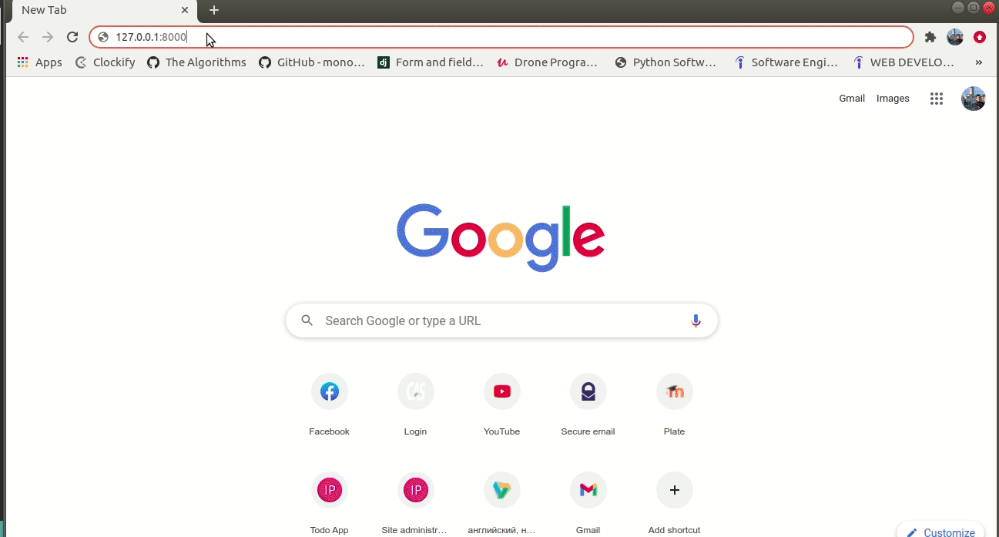

# Advanced To Do App
  
  This app has basic to do app features and also some additional functionalities.
 
  ### Here they are:

  - To acces the page user should sign in or sign up/sign in
  - It is possible to reset a password using email adress
  - For sure users can create, update and delete tasks.
  - Each task consist of title, description and task deadline.
  - Users can also share tasks with other users using their email adress or their username.
  - Sharing is possible in 2 modes (read or read/comment). (did that by building custom row-level permissions)
  - Users can comment tasks in real time.
  - Users can edit and delete their own comments in real time.
  - Task author can delete all comments to his task.
  - 10 minutes before task deadline a warning email is sent to a user's email adress

  ### Demo
  
  <br/>
  <br/>
  

  ### Technologies used in developement

  - [Django](https://www.djangoproject.com/)
  - [Docker](https://www.docker.com/) only for dev. env. .
  - [Django Channels](https://channels.readthedocs.io/) to allow users to comment tasks in real time.
  - [Celery](https://docs.celeryproject.org/) to send emails 10 minutes before task deadline.
  - [Redis](https://redis.io/) as celery broker and as channel layer.

    
    
  ### Installation
  In order to run the application in local environment follow instructions below:
  
  ```bash
  # clone
  git clone https://github.com/r-aliev/advanced-to-do-app.git
  
  cd advanced-to-do-app
  
  docker-compose up --build

  ```
    Check your localhost on :8000 port
  
  #### Note 
  Super user will be created automatically.
  Use these creds to sign in like a superuser.
  ```
  username: admin
  password: veryStrongPassword123
  ```
